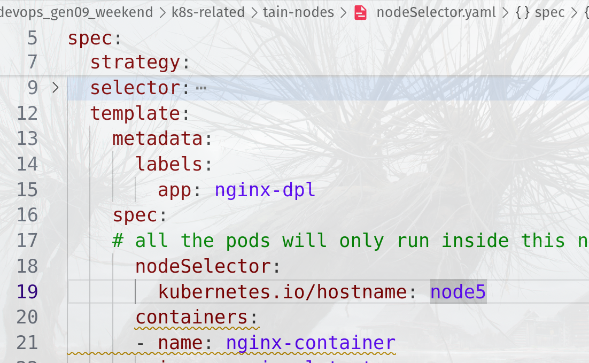

## NOTE FOR DEPLOYMENT STRATEGIES 

```bash
cd kubernetes_breakdown/dpl_strategies/blue_green
# . all files inside the folder 
kubectl apply -f . 

kubectl get service 
kubectl get deployment 

# inside service.yaml , edit the replicas:blue to replicas: green 
kubectl apply -f service.yaml 

```


## Fixing the sudo kubectl 
```bash
mkdir -p $HOME/.kube
sudo cp /etc/rancher/k3s/k3s.yaml $HOME/.kube/config
sudo chown $(id -u):$(id -g) $HOME/.kube/config
export KUBECONFIG=$HOME/.kube/config
kubectl get nodes

```
## ROLLING OUT 
```bash

```
curl service-ip 
## Working with node selector 


